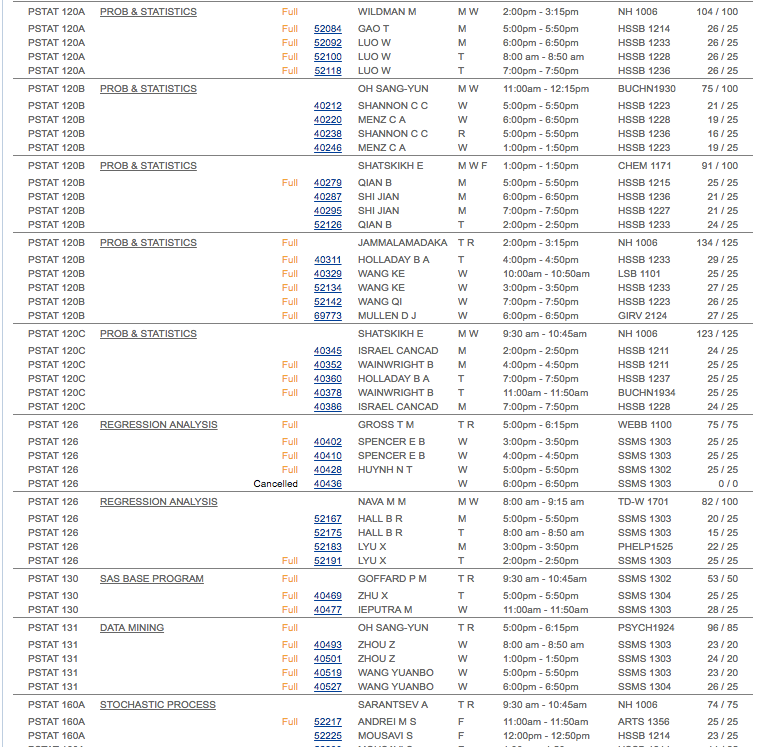

# Class Listings Scraper
Web scraper for aggregating information on a list of designated UCSB classes.

## TABLE OF CONTENTS

* [Abstract](##Abstract)
* [Additional Resources](##Additional-Resources)
* [Dependencies Required](##Dependencies-Required)
* [Virtual Environments (optional)](##Virtual-Environments)
* [Steps Required](##Steps-Required)
* [Making the Website Request](##Website-Requests)

## Abstract
The goal is to go from [this](https://my.sa.ucsb.edu/public/curriculum/coursesearch.aspx):
to this:

to populate a spreadsheet like this:


Making requests to an .aspx page is difficult, as the hyperlink does not change after one puts in the desired parameters. A different approach is instead to make a request onto the server. At first, it did not matter what parameters we put in; the same html file would keep getting outputted with no parameters selected. With an assist from our club president Jason Freeberg, we figured our we needed a cookie in order to save the parameters and actually execute the different requests.

There are many ways that we can do this, but the best way is to use Python's *Requests* package to make a call to the UCSB Course Catalog Server, get a cookie to make specific requests by quarter and year, then use the *Beautiful Soup* package to extract the desired attributes (class name, description, teacher, time, capacity) from the resulting HTML pages we write (among other packages).

After extracting the desired attributes, it would be very easy to put all of this into a csv file via the *csvwriter* package and then just open it in Microsoft Excel; however, the normal medium we require this list of classes to be in Google Spreadsheets. Therefore, we will be utilizing the ["GDATA Python Client"](http://nirvanatikku.tumblr.com/post/61232391054/inserting-rows-into-a-google-spreadsheet-with) to take our extracted elements and put them into a final Google Spreadsheet for all to use.

We wish to automate this process so that we can simply run a few python programs and then get the resulting Google Spreadsheet for us. So far the website calls and attribute extraction have been automated; now we just need to figure out how to translate it into a Google Spreadsheet (and a few other errors with attribute extraction).

We will be updating this README as we progress more.

## Additional Resources

The biggest resource we used for this project is [Automate the Boring Stuff with Python](https://github.com/mussaimo/aquarius/blob/master/epub/Automate-the-Boring-Stuff-with-Python.pdf)

This constituted the main chunk of the code we ended up using.

Other links we used to help with this project:
+ [Making Requests to .aspx Pages in Python](http://stackoverflow.com/questions/1480356/how-to-submit-query-to-aspx-page-in-python)
+ [Starting Sessions, Making Requests, Parsing Request Data](https://github.com/hgielar/GOLD-schedule-exporter/blob/master/GOLD_Schedule_Tracker.py) (this one was taken from code made by a fellow UCSB student Raleigh Littles III; thank you for your hard work.)
+ [Dealing with SSL Certificate Errors](http://stackoverflow.com/questions/42098126/mac-osx-python-ssl-sslerror-ssl-certificate-verify-failed-certificate-verify)

## Dependencies Required

Here are a list of all the packages we need for this project:

```
urllib
bs4
requests
sys
re
```

Python 3.5 and later is also required for this project.

## Virtual Environments

### DISCLAIMER: This section is optional!

If you do not wish to have the required packages downloaded and take up space on your computer, you can do virtual environments instead! We already have made a **requirements.txt** file with all the proper packages ready to be installed. This also doubles in that you will not have to worry about package conflictions and different version errors.

You will have to install the package **virtualenv** as so below:

```
pip3 install virtualenv
```

Then follow these steps to install and set up your virtual environment:

```
virtualenv YOUR-VIRTUAL-ENVIRONMENT-NAME-HERE
# So using "virtualenv venv" would make a virtual environment called "venv"
source venv/bin/activate
pip3 install -r requirements
```

And that's it! You're now ready to run these programs!

## Steps Required

The entire process we took for this project are:

+ Start a new session and update its headers with my computer information
+ Make a request to the UCSB Course Catalog API and get various form data for making requests
+ Now that these things are saved, prompt the user for the quarter and year they desire
+ Save the user input, and make new requests to the API with the new user input and other information
+ One request will be made per set of departments (here we have PSTAT, MATH and CMPSC; may add more)
+ Extract the html text from the request, "prettify" it, and save it to an HTML file
+ Iterate each of the files and parse the tags by where we have the attributes "CourseInfoRow"
+ Strip out the string data, parse for relevant class information (current)
+ Save this information to a Google Sheets (current)

We currently have extracted most of the relevant data we need; however, there are still issues when it comes to gathering info about day of the week. Also, we are working our way to save the data into a Google Spreadsheet rather than a CSV file.

This process can be divided into these three main sections: Website Requests, Attribute Extraction, and Saving to a Google Spreadsheet.

### Website Requests

We start a new "session", update the session with the details of my specific computer ("User-Agent") and make a request to get the four key things below:

+ View State
+ View State Generator
+ Event Validation
+ ASP.NET_SessionId" (This is the school's version of a cookie)

This is necessary form data we need into order to make the class specific requests.

Now that we have the necessary data to make requests, we will make new requests for each set of classes we have. Taking in user input, we convert this to necessary fields to finish the request.

The five sets of classes we have are:

+ PSTAT
+ MATH
+ CMPSC
+ ECON
+ ENGR

(May be updated later)

The output of the program *htmlScraper.py* should yield 5 HTML files with the corresponding classes above in each separate file (PSTAT classes in PSTAT.html, MATH classes in MATH.html, etc.)

### Attribute Extraction


### Saving to a Google Spreadsheet
