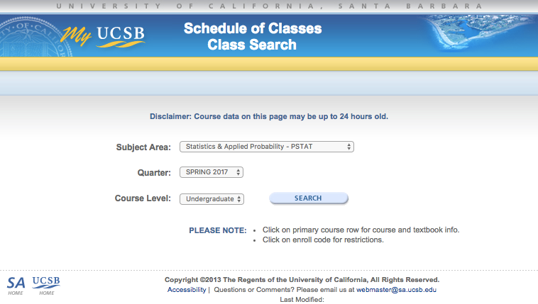

# Class Listings Scraper
Web scraper for aggregating information on a list of designated UCSB classes.

## Usage
arguments:
```
$ python UCSB-course-scraper.py -h
UCSB Data Science Course Info Scraper
Developed by NATHAN FRITTER and TIMOTHY NGUYEN
==================================================
usage: UCSB-course-scraper.py [-h] [-o OUTPUT_DIRECTORY] quarter year
 
Scrape UCSB's course listings and output data to CSV
 
positional arguments:
  quarter
  year

optional arguments:
  -h, --help            show this help message and exit
  -o OUTPUT_DIRECTORY, --output_directory OUTPUT_DIRECTORY

                        manually designate output file

```

Here's how to get course info for PSTAT, MATH, and CMPCS courses for FALL 2017 and output to CSVs to designated output directory with the optional argument `-o`:
```
$ python UCSB-course-scraper.py fall 2017 -o ~/Documents/data-sci/class-announcements
UCSB Data Science Course Info Scraper
Developed by NATHAN FRITTER and TIMOTHY NGUYEN
==================================================
PSTAT courses for FALL 2017 outputted to /Users/timmy/Documents/data-sci/class-announcements/PSTAT-FALL2017.csv
MATH courses for FALL 2017 outputted to /Users/timmy/Documents/data-sci/class-announcements/MATH-FALL2017.csv
CMPSC courses for FALL 2017 outputted to /Users/timmy/Documents/data-sci/class-announcements/CMPSC-FALL2017.csv
```

If no output directory is specified, the program will use the current working directory by default:
```
$ python UCSB-course-scraper.py fall 2017
UCSB Data Science Course Info Scraper
Developed by NATHAN FRITTER and TIMOTHY NGUYEN
==================================================
PSTAT courses for FALL 2017 outputted to ./PSTAT-FALL2017.csv
MATH courses for FALL 2017 outputted to ./MATH-FALL2017.csv
CMPSC courses for FALL 2017 outputted to ./CMPSC-FALL2017.csv
```


## Goal
The goal is to go from [this](https://my.sa.ucsb.edu/public/curriculum/coursesearch.aspx):

to this:

to populate a spreadsheet like this:


# To-do
- integrate with google drive
- generalize to all departments
